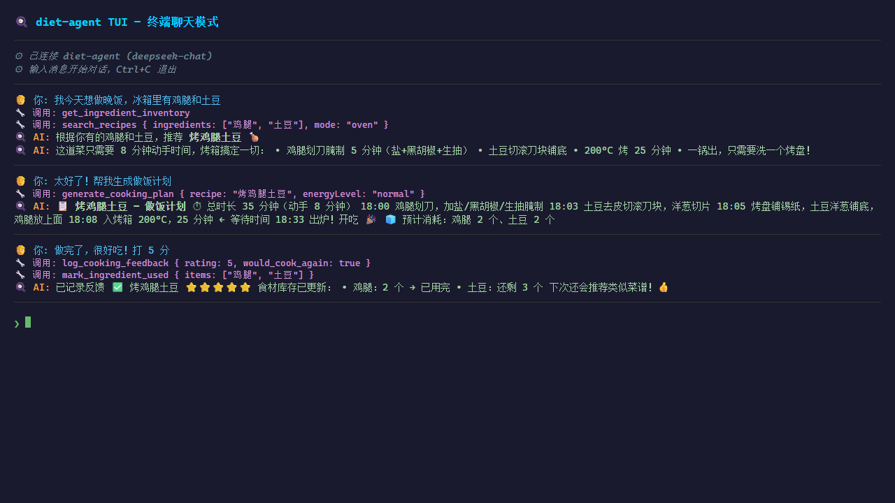

# 🍳 晚饭工作流 — 个人饮食管理智能体（终端版）

[](https://github.com/20212661/diet-agent/actions/workflows/ci.yml)
[](https://vitest.dev)
[](https://www.typescriptlang.org/)
[](https://nodejs.org)

基于 **@earendil-works/pi-coding-agent** SDK 构建的智能晚饭管理助手。

面向**独居/双人的下班做饭场景**，覆盖「买菜 → 入库 → 计划 → 做饭 → 反馈 → 周末备菜」完整循环。
**纯终端交互**——一个命令进入全屏聊天界面，自然语言操作一切。

## 🖼 系统展示

### 终端聊天界面



> `diet-agent` 启动后进入全屏终端聊天，`Enter` 发送、`Ctrl+C` 退出。

## ✨ 主要功能

- 🧾 **25 道内置菜谱** — 覆盖快手/一锅出/明火/烤制等多种模式
- 🛒 **购物清单** — 根据已有库存和菜谱推荐买什么
- 🍳 **生成晚饭计划** — 分钟级时间线 + 低能量版本（"我今天很累" → 低能量方案）
- 🍽️ **记录三餐 + 反馈** — AI 越用越懂你
- 🧊 **食材库存管理** — 冷藏/冷冻/储藏/室温分类，过期提醒
- 📅 **一周菜单计划** — 7 天不重复，自动避开忌口、优先用已有食材
- 💬 **自然语言交互** — 终端里直接聊：告诉我你有什么、想吃什么、累不累

## 🚀 快速开始

### 1. 安装

```bash
npm install
```

### 2. 配置 API Key

```bash
cp .env.example .env
```

编辑 `.env`，填写**至少一个**模型供应商的 API Key：

```env
# DeepSeek（推荐，性价比高）
DEEPSEEK_API_KEY=sk-your-deepseek-key-here

# 或者 智谱 GLM（国内访问稳定）
ZAI_API_KEY=your-zai-key-here
```

> 💡 不设置 `MODEL_PROVIDER` 时会自动检测已配置的 Key，优先级：DeepSeek → GLM → OpenAI → Anthropic → OpenRouter。

### 3. 启动

```bash
# 方式一：全局命令（推荐）
npm link          # 首次需要注册
diet-agent        # 进入终端聊天

# 方式二：直接运行
npm start

# 指定用户 ID（多设备/多人区分数据用）
diet-agent my_user
# 或
npm start -- my_user
```

启动后进入全屏终端界面，`Enter` 发送，`Ctrl+C` 退出。首次聊天时告诉助手你的饮食目标、忌口、厨房条件即可，它会自动记录到本地数据库。

## 📋 日常使用

打开终端直接对话，示例：

```
🧑 你：我今天很累，库存有鸡腿和番茄，15 分钟能搞定的晚饭
🤖 饮食助手：（调用工具查库存 + 匹配菜谱，给出时间线）

🧑 你：我晚饭吃了番茄炒蛋和米饭
🤖 饮食助手：✅ 已记录晚餐...

🧑 你：帮我安排这周吃什么
🤖 饮食助手：（生成一周菜单，避开忌口、优先用已有食材）

🧑 你：今天吃得怎么样？
🤖 饮食助手：（汇总今日饮食和热量估算）
```

工作流循环：

```
打开终端
    ├─ ① "我库存有 X、Y、Z" → 自动入库
    ├─ ② "今天做什么" → 生成晚饭计划（含时间线）
    ├─ ③ 太累？"我很累" → 低能量方案
    ├─ ④ 做完 → "我吃了 ..." → 记录
    ├─ ⑤ 反馈 → "这道菜太累/太油/下次还做" → 系统学习偏好
    └─ 周末 → "安排一周菜单" → 周计划 + 备菜建议
```

## 🧩 支持的模型

| Provider | 环境变量 | 说明 |
|----------|----------|------|
| **deepseek** | `DEEPSEEK_API_KEY` | 推荐性价比高 |
| **zai** | `ZAI_API_KEY` | 智谱 GLM，国内直连稳定 |
| **openai** | `OPENAI_API_KEY` | OpenAI GPT 系列 |
| **anthropic** | `ANTHROPIC_API_KEY` | Anthropic Claude |
| **openrouter** | `OPENROUTER_API_KEY` | 聚合网关，多种模型 |

## 🔑 API Key 安全

- `.env` 已在 `.gitignore` 中，**不会**被提交到版本库。`.env.example` 仅为模板（值为空），切勿填入真实 key 后提交。
- 数据本地化：用户画像、库存、菜谱、对话历史全部存在本地 `data/` 目录（同样被 gitignore）。

## 📂 项目结构

```
src/
  tui/
    index.ts                     # TUI 入口（加载日志、读取 userId）
    chat-tui.ts                  # 终端聊天界面（直接调用 Agent，无 HTTP 中转）
  agent/
    createDietAgent.ts           # Agent 创建 + 消息发送（会话按 userId 持久化）
    modelAdapter.ts              # 多模型适配（DeepSeek/GLM/OpenAI...）+ 自动降级
    sessionStore.ts              # userId → Agent session 映射
    systemPrompt.ts              # 分层系统提示词 + 动态用户记忆注入
    prompts/                     # 分层提示词（身份/工具/烹饪/饮食/安全）
  recipes/
    recipeBook.ts                # 内置菜谱管理
    recipeMatcher.ts             # 菜谱匹配算法（多维度评分）
    recipeSeed.json              # 25 道菜谱种子数据
  store/
    sqliteStore.ts               # SQLite 持久化存储
    index.ts                     # 统一存储导出
  tools/                         # Agent 工具定义（15 个）
  types/
    diet.ts                      # TypeScript 类型定义
  utils/
    errors.ts                    # 错误处理
    requestLogger.ts             # LLM API 请求日志（patch fetch）
bin/
  diet.js                        # CLI 入口（npm link 后即 diet-agent 命令）
data/                            # 本地数据（自动创建，已被 gitignore）
  diet-agent.sqlite              # 业务数据持久化
  sessions/<userId>/             # 按 userId 隔离的对话历史（JSONL，重启恢复）
logs/                            # 请求日志（自动创建，已被 gitignore）
```

## 🔧 技术栈

| 组件 | 技术 |
|------|------|
| 终端 UI | @earendil-works/pi-tui |
| AI SDK | @earendil-works/pi-coding-agent |
| 数据库 | SQLite (better-sqlite3) |
| 运行时 | tsx (开发) / tsc + node (生产) |
| 测试 | vitest + GitHub Actions |

## 🏗 架构概览

一条消息的完整链路：

```
用户输入 (TUI)
    │
    ▼
Agent 编排层 ── 按 userId 串行化消息，避免并发写冲突
    │  （系统提示词 = 分层静态提示词 + 动态用户记忆，实时从 SQLite 注入）
    ▼
多模型适配层 ── 候选链 DeepSeek→GLM→OpenAI…，按错误类型自动降级
    │
    ▼
LLM 决策调用工具
    │
    ▼
工具参数修复中间件 ── 统一兜底 LLM 输出的 数组 / 布尔 / 数字 / 缺失字段
    │
    ▼
15 个领域工具 ── 读写 SQLite（画像 / 库存 / 三餐 / 反馈 / 周计划）
    │
    ├─ search_recipes：「向量召回(sqlite-vec) + 关键词召回(FTS5/BM25)」→ RRF 融合 → matcher 精排
    │                  （hybrid；无 embedding key 时仍用 FTS5 关键词通道）
    │
    └─ 菜谱推荐走「确定性评分算法」，而非让 LLM 直接推荐
    ▼
回复 → TUI 渲染（Markdown）
```

**核心分工：LLM 负责「理解意图 + 编排 + 自然语言」，确定性算法负责「需要稳定可测的决策」**（菜谱排序、忌口过滤、时间约束、厨房匹配）。

## 🔌 哪些是自研（SDK 边界）

本项目基于 `@earendil-works/pi-*` 系列构建。诚实划分各自职责——面试时可以直接对照这张表：

| 能力 | 提供方 |
|------|--------|
| Agent 主循环 / 工具调用协议 / 流式响应 | `pi-coding-agent` |
| 终端 TUI 渲染框架 | `pi-tui` |
| 各模型 SDK 封装（`getModel`） | `pi-ai` |
| **业务领域模型**（菜谱 / 库存 / 画像 / 反馈 / 周计划） | ✅ 自研 |
| **SQLite 持久化 + schema 迁移** | ✅ 自研 |
| **多维度菜谱评分匹配算法** | ✅ 自研 |
| **hybrid 召回（sqlite-vec 向量 + FTS5 关键词 + 手写 RRF）** | ✅ 自研 |
| **多模型候选链 + 错误感知降级** | ✅ 自研 |
| **工具参数修复中间件** | ✅ 自研 |
| **分层系统提示词 + 动态用户记忆注入** | ✅ 自研 |
| **15 个领域工具** | ✅ 自研 |

## 🧠 关键工程决策

### 1. 用确定性评分算法推荐菜谱，而非纯让 LLM 推荐
- **为什么**：菜谱推荐本质是「多维加权排序 + 硬约束（忌口 / 烤箱 / 时间）」。LLM 在这类任务上不稳定、不可复现、每次都耗 token；评分算法零额外成本、结果可复现、可单测。
- **代价**：权重需手工调，菜谱必须维护结构化字段（食材 / 电器 / 难度…）。
- **结果**：`recipeMatcher` 单测覆盖率 72%，LLM 只在它给的候选上做编排和润色。

### 2. 工具参数修复中间件（`repairToolArguments`）
- **为什么**：实测 GLM / DeepSeek 等模型经常把数组传成逗号字符串、布尔传成 `"是"`、漏填 `userId`。与其在每个工具里打补丁，不如在中间件统一兜底。
- **代价**：多一层隐式类型转换。
- **结果**：工具实现保持干净，工具调用成功率显著提升。

### 3. 多模型候选链 + 错误感知降级
- **为什么**：单一模型会 429 / 超时 / schema 报错。按错误文本判定是否切到下一个候选，并复用同一 `sessionDir`，fallback 时对话历史不丢。
- **代价**：降级逻辑增加复杂度，需维护候选优先级。

### 4. SQLite 存 JSON 字段而非完全范式化
- **为什么**：单机应用、读多写少、字段随业务快速演进。JSON blob + 按列检测的 schema 迁移（`addColumnIfMissing`）比频繁 `ALTER TABLE` 轻。
- **代价**：无法在 SQL 级查询数组内部元素。
- **取舍**：对单机工具型应用是合理的——迭代速度优先于关系纯度。

### 5. hybrid 召回（向量 + 关键词 + RRF），精排仍交给确定性算法
- **为什么**：单向量通道抓语义强但精确关键词弱（查"番茄"未必排前）；纯关键词抓精确但漏语义。hybrid 两通道互补——向量抓"清爽夏日菜"，关键词抓"番茄"。
- **方案**：sqlite-vec 向量召回 + FTS5 BM25 关键词召回，各取 top-N，**RRF 融合**（只看排名、不看分数，规避向量距离与 BM25 分数量纲不一致）取 top-K，再交 `recipeMatcher` 精排（忌口 -999、时间、反馈）。精排和安全过滤绝不交给模糊的相似度。
- **关键细节**：① 向量归一化让 sqlite-vec 的 L2 与余弦等价；② FTS5 默认对中文不分词，用 bigram 双字预处理解决；③ 降级矩阵——任一通道失败用单通道，都失败才退回纯 matcher；④ 无 embedding key 时 FTS5 关键词通道仍工作；⑤ 换 provider（1024↔1536 维）触发一次向量重建。

## ✅ 测试与持续集成

- **框架**：vitest，15 个用例覆盖菜谱匹配、食材歧义保护、schema 迁移、工具参数修复、模型降级判定、周计划持久化等核心逻辑；用 `:memory:` SQLite 隔离，不污染生产数据。
- **CI**：GitHub Actions 在 Node 20/22 上跑 `typecheck` + `test:coverage`，覆盖率产物作为 artifact 上传。
- **关键模块覆盖率**：菜谱匹配 72%、周计划生成 91%、SQLite 存储 70%。

```bash
npm test               # 跑全部测试
npm run test:watch     # watch 模式
npm run test:coverage  # 生成覆盖率报告（coverage/）
```

## 🛠 其他命令

```bash
npm run build       # 编译到 dist/
npm run typecheck   # 类型检查
```

## ⚠️ 当前限制

1. **热量估算**：未接入食物营养数据库，为粗略估算
2. **单终端会话**：同一 userId 同时只建议开一个终端实例（避免并发写冲突）
3. **API Key 管理**：见上方 [🔑 API Key 安全](#-api-key-安全) 章节
