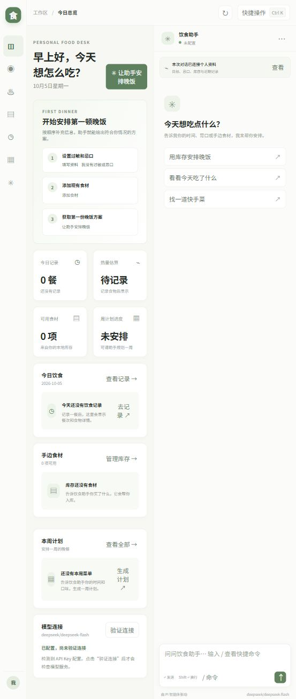

# 🍳 晚饭工作流 — 个人饮食管理工作台

[](https://github.com/20212661/diet-agent/actions/workflows/ci.yml)
[](https://vitest.dev)
[](https://www.typescriptlang.org/)
[](https://nodejs.org)

基于 **@earendil-works/pi-coding-agent** SDK 构建的智能晚饭管理助手。

面向**独居/双人的下班做饭场景**，覆盖「买菜 → 入库 → 计划 → 做饭 → 反馈 → 周末备菜」完整循环。
默认启动本地 Web 工作台：左侧切换资料、厨房、库存、饮食记录和周计划，中间查看业务信息，右侧与 Pi 智能体对话。用户资料、厨房设置和食材库存可以在页面编辑并保存到 SQLite；下一轮对话会自动读取更新后的上下文。数据和 API Key 留在本机；终端 Pi 交互仍可单独启动。

快捷键：`Ctrl+K` 打开页面搜索，`Ctrl+1` 至 `Ctrl+7` 切换工作区，`Ctrl+J` 聚焦聊天框。在聊天框输入 `/` 可打开快捷命令菜单。

## 🖼 系统展示

### Web 饮食工作台



### Pi 终端聊天界面


> 使用 `npm run tui` 或 `diet-agent --tui` 进入 Pi 原生全屏交互应用。默认的 `npm start` 启动浏览器工作台。

截图来自 2026-10-05 实际运行的 Web 与 TUI，使用独立演示用户 `demo_user`。

## ✨ 主要功能

- 🧾 **69 道内置菜谱** — 覆盖快手/一锅出/明火/烤制等多种模式
- 🛒 **购物清单** — 根据已有库存和菜谱推荐买什么
- 🍳 **生成晚饭计划** — 分钟级时间线 + 低能量版本（"我今天很累" → 低能量方案）
- 🥗 **一日到七日饮食计划** — 从菜谱和库存生成四餐安排，应用过敏、临时忌口、精力与主动操作时间限制，并支持保存后按日查看
- 🍽️ **记录三餐 + 反馈** — AI 越用越懂你
- 🧊 **食材库存管理** — 冷藏/冷冻/储藏/室温分类，过期提醒
- 📅 **一周菜单计划** — 7 天不重复，自动避开忌口、优先用已有食材
- 💬 **自然语言交互** — 终端里直接聊：告诉我你有什么、想吃什么、累不累

## 🚀 快速开始

### 1. 安装

```bash
npm install
npm run build
```

### 2. 配置 API Key

```bash
cp .env.example .env
```

编辑 `.env`，填写**至少一个**模型供应商的 API Key：

```env
# DeepSeek（推荐，性价比高）
DEEPSEEK_API_KEY=sk-your-deepseek-key-here

# 或者 智谱 GLM（国内访问稳定）
ZAI_API_KEY=your-zai-key-here
```

> 💡 不设置 `MODEL_PROVIDER` 时会自动检测已配置的 Key，优先级：DeepSeek → GLM → OpenAI → Anthropic → OpenRouter。

配置完成后先做一次不会输出 Key 的诊断：

```bash
npm run doctor
```

修改源码但尚未重新构建时，可用 `npm run doctor:dev` 直接检查开发配置。

DeepSeek 推荐配置为 `MODEL_PROVIDER=deepseek`、`MODEL_ID=deepseek-flash`。旧名称 `deepseek-v4-flash` 会自动归一化。

### 3. 启动

```bash
# 方式一：本地 Web 工作台（推荐）
npm start         # 浏览器访问 http://127.0.0.1:4173

# 终端 Pi 交互模式
npm run tui
# 或构建后
diet-agent --tui

# 指定用户 ID（多设备/多人区分数据用）
diet-agent my_user
# 或
npm start -- my_user
```

本地 Web 服务只接受 `localhost`、`127.0.0.1` 或 `::1` 回环绑定；设置 `WEB_HOST=0.0.0.0`、局域网 IP 或其他地址时会拒绝启动。服务不提供远程登录，因此不会开放到局域网；请求还会校验 Host，写入 API 会校验 Origin 和 JSON 内容类型，防止 DNS 重绑定和跨站写入。端口可通过 `WEB_PORT` 修改。终端 Pi 模式中，`Enter` 发送，输入 `/` 搜索命令，`Shift+Enter` 换行；内置 `/model` 可选择已配置的模型，`/resume`、`/new`、`/tree`、`/settings` 等 Pi 命令也可使用。

Web 聊天请求按操作 ID 保存最终状态。服务重启后查询同一请求，会返回已保存的完整回复；若上次请求没有留下最终状态，则提示核对记录，且不会自动重做可能已发生的写入。

重启会恢复当前用户最近的 Pi 会话；用户记忆更新或模型切换时保留当前会话分支和消息。浏览器在读取服务端用户身份后，才恢复该用户的未完成请求；恢复缓存按 userId 隔离，旧版无用户身份的缓存不会自动恢复。

所有 Web 写入请求（含聊天恢复）都必须携带 `X-Diet-User-Id`，其值为当前用户 ID 的 `encodeURIComponent` 编码。服务端在处理请求前核对身份；缺失或不匹配返回 HTTP 409，旧页面需要刷新并核对当前用户。该检查用于防止服务切换用户后恢复到错误的数据空间，不替代登录认证。

饮食计划和周计划读回时会按最新过敏忌口、厨房设备、厨具与时间限制重新校验，不覆盖原始计划。条件变化后无法执行的餐次会显示“需重新安排”。库存按各餐日期核对到期日，采购清单中的食材仍算待购；缺少设备或总耗时信息的旧模板需要重新生成。做饭计划按主菜与配菜顺序执行估算整餐时间。

Pi 命令之外，饮食助手扩展还提供：

| 命令 | 功能 |
|------|------|
| `/doctor` | 重新检查认证、模型和网络状态，不显示 Key |
| `/profile` | 查看用户饮食画像和厨房设备 |
| `/data` | 查看当前用户在数据库、会话、导出和诊断日志中的数据数量 |
| `/diet-export` | 导出当前用户饮食数据、会话文件和请求日志 |
| `/delete-data` | 预览数据；再次输入 `/delete-data CONFIRM` 并确认后删除 |

`/model` 和 `/export` 使用 Pi 的原生命令：前者切换模型，后者导出 Pi 会话。饮食数据导出使用 `/diet-export`；开始新对话使用 Pi 的 `/new`。如需使用旧版自定义聊天界面，可在启动前设置 `DIET_TUI_MODE=legacy`。

## 📋 日常使用

打开终端直接对话，示例：

```
🧑 你：我今天很累，库存有鸡腿和番茄，15 分钟能搞定的晚饭
🤖 饮食助手：（调用工具查库存 + 匹配菜谱，给出时间线）

🧑 你：我晚饭吃了番茄炒蛋和米饭
🤖 饮食助手：✅ 已记录晚餐...

🧑 你：帮我安排这周吃什么
🤖 饮食助手：（生成一周菜单，避开忌口、优先用已有食材）

🧑 你：今天吃得怎么样？
🤖 饮食助手：（汇总今日饮食和热量估算）
```

工作流循环：

```
打开终端
    ├─ ① "我库存有 X、Y、Z" → 自动入库
    ├─ ② "今天做什么" → 生成晚饭计划（含时间线）
    ├─ ③ 太累？"我很累" → 低能量方案
    ├─ ④ 做完 → "我吃了 ..." → 记录
    ├─ ⑤ 反馈 → "这道菜太累/太油/下次还做" → 系统学习偏好
    └─ 周末 → "安排一周菜单" → 周计划 + 备菜建议
```

## 🧩 支持的模型

| Provider | 环境变量 | 说明 |
|----------|----------|------|
| **deepseek** | `DEEPSEEK_API_KEY` | 推荐性价比高 |
| **zai** | `ZAI_API_KEY` | 智谱 GLM，国内直连稳定 |
| **openai** | `OPENAI_API_KEY` | OpenAI GPT 系列 |
| **anthropic** | `ANTHROPIC_API_KEY` | Anthropic Claude |
| **openrouter** | `OPENROUTER_API_KEY` | 聚合网关，多种模型 |

## 🔑 API Key 安全

- `.env` 已在 `.gitignore` 中，**不会**被提交到版本库。`.env.example` 仅为模板（值为空），切勿填入真实 key 后提交。
- 数据本地化：用户画像、库存、菜谱、对话历史全部存在本地 `data/` 目录（同样被 gitignore）。
- LLM 请求日志默认关闭；仅在临时调试时设置 `ENABLE_REQUEST_LOGGING=1`。日志可能包含完整对话、健康备注和模型响应。Agent 普通诊断日志默认省略工具参数、结果和模型错误正文。
- `/data`、`/diet-export` 和 `/delete-data` 管理当前 `USER_ID` 的本地数据；删除需二次确认。迁移备份最多保留 3 份、最长 30 天，删除时会清理现存备份中的该用户记录。手工或外部备份不受应用管理。详细说明见 [本地数据管理](docs/privacy.md)。
- `npm run doctor` 只报告供应商、模型和错误类别，不输出 API Key 或 Key 片段。

## 📂 项目结构

```
src/
  web/
    index.ts                     # 本地工作台 HTTP 路由与启动
    chatStream.ts                # 聊天流、操作终态与重试
    payloadValidation.ts         # 请求参数校验
    profileWrites.ts             # 资料、厨房和库存表单保存
    receiptParser.ts             # 小票图片识别与结果过滤
  tui/
    index.ts                     # TUI 入口（按配置加载日志、读取 userId）
    pi-interactive.ts            # Pi 原生 InteractiveMode 与饮食 Agent 运行时集成
    diet-extension.ts            # 饮食助手命令与用户身份上下文扩展
    chat-tui.ts                  # 旧版自定义终端聊天界面
  agent/
    createDietAgent.ts           # Agent 创建 + 消息发送（会话按 userId 持久化）
    modelAdapter.ts              # 多模型适配；旧版 TUI 使用自动降级
    modelProviders.ts            # 数据驱动的供应商、默认模型和别名配置
    sessionStore.ts              # 带 LRU/TTL/容量限制的会话缓存
    persistentSession.ts         # 用户会话目录与真实 SDK 会话恢复
    systemPrompt.ts              # 分层系统提示词 + 动态用户记忆注入
    prompts/                     # 分层提示词（身份/工具/烹饪/饮食/安全）
  recipes/
    recipeBook.ts                # 内置菜谱管理
    recipeMatcher.ts             # 菜谱匹配算法（多维度评分）
    ingredientTaxonomy.ts        # 规范化食材 ID、过敏原及别名表
    executionConstraints.ts      # 菜谱与模板共用执行约束
    mealPlanValidation.ts        # 已保存饮食计划读回校验
    recipeSchema.ts              # TypeBox Schema 与跨字段构建校验
    recipeSeed.json              # 69 道菜谱种子数据
  store/
    database.ts                  # SQLite 连接生命周期
    migrations/                  # PRAGMA user_version 版本化迁移与升级前备份
    repositories/                # 画像、厨房、库存、饮食、反馈、菜谱、周计划仓储
    sqliteStore.ts               # 兼容旧导入路径的统一 facade
    index.ts                     # 统一存储导出
  tools/                         # Agent 工具定义（20 个）
  types/
    diet.ts                      # TypeScript 类型定义
  utils/
    errors.ts                    # 错误处理
    requestLogger.ts             # 可选的 LLM API 请求日志（patch fetch）
bin/
  diet.js                        # CLI 入口（npm link 后即 diet-agent 命令）
data/                            # 本地数据（自动创建，已被 gitignore）
  diet-agent.sqlite              # 业务数据持久化
  sessions/<userHash>/           # 按 userId 的稳定哈希隔离对话历史（JSONL，重启恢复）
logs/                            # 请求日志（显式开启后创建，已被 gitignore）
```

## 🔧 技术栈

| 组件 | 技术 |
|------|------|
| 终端 UI | @earendil-works/pi-tui |
| AI SDK | @earendil-works/pi-coding-agent |
| 数据库 | SQLite (better-sqlite3) |
| 运行时 | tsx (开发) / tsc + node (生产) |
| 测试 | vitest + GitHub Actions |

## 🏗 架构概览

一条消息的完整链路：

```
用户输入 (Pi InteractiveMode)
    │
    ▼
Agent 编排层 ── 按 userId 串行化消息，避免并发写冲突
    │  （系统提示词 = 分层静态提示词 + 创建会话时从 SQLite 注入的用户记忆）
    ▼
Pi Agent Runtime ── 使用配置的主模型；可在 `/model` 中切换候选模型（旧版 TUI 保留自动降级）
    │
    ▼
LLM 决策调用工具
    │
    ▼
工具参数修复中间件 ── 统一兜底 LLM 输出的 数组 / 布尔 / 数字 / 缺失字段
    │
    ▼
20 个领域工具 ── 读写 SQLite（画像 / 库存 / 三餐 / 反馈 / 饮食计划）
    │
    ├─ search_recipes：默认 FTS5/BM25；显式启用后「向量召回 + 关键词召回」→ RRF → matcher 精排
    │
    └─ 菜谱推荐走「确定性评分算法」，而非让 LLM 直接推荐
    ▼
回复 → Pi InteractiveMode 渲染（Markdown、工具状态、会话信息）
```

**核心分工：LLM 负责「理解意图 + 编排 + 自然语言」，确定性算法负责「需要稳定可测的决策」**（菜谱排序、忌口/过敏硬过滤、时间约束、厨房匹配）。

## 🔌 哪些是自研（SDK 边界）

本项目基于 `@earendil-works/pi-*` 系列构建。诚实划分各自职责——面试时可以直接对照这张表：

| 能力 | 提供方 |
|------|--------|
| Agent 主循环 / 工具调用协议 / 流式响应 | `pi-coding-agent` |
| 终端交互应用与渲染 | `pi-coding-agent` InteractiveMode + `pi-tui` |
| 各模型 SDK 封装（`getModel`） | `pi-ai` |
| **业务领域模型**（菜谱 / 库存 / 画像 / 反馈 / 周计划） | ✅ 自研 |
| **SQLite 持久化 + schema 迁移** | ✅ 自研 |
| **多维度菜谱评分匹配算法** | ✅ 自研 |
| **FTS5 默认召回 + 可选 hybrid（OpenAI/GLM/本地 bge-small-zh + RRF）** | ✅ 自研 |
| **规范化食材、过敏原别名与 TypeBox 菜谱校验** | ✅ 自研 |
| **多模型候选链 + 错误感知降级** | ✅ 自研 |
| **工具参数修复中间件** | ✅ 自研 |
| **分层系统提示词 + 动态用户记忆注入** | ✅ 自研 |
| **20 个领域工具** | ✅ 自研 |

## 🧠 关键工程决策

### 1. 用确定性评分算法推荐菜谱，而非纯让 LLM 推荐
- **为什么**：菜谱推荐本质是「多维加权排序 + 忌口和设备硬约束」。明确给出时间上限的计划生成与搜索会再过滤超时菜谱。LLM 在这类任务上不稳定、不可复现、每次都耗 token；评分算法零额外成本、结果可复现、可单测。
- **代价**：权重需手工调，菜谱必须维护结构化字段（食材 / 电器 / 难度…）。
- **结果**：LLM 只在确定性筛选给出的候选上做编排和润色。

### 2. 工具参数修复中间件（`repairToolArguments`）
- **为什么**：实测 GLM / DeepSeek 等模型经常把数组传成逗号字符串、布尔传成 `"是"`、漏填 `userId`。与其在每个工具里打补丁，不如在中间件统一兜底。
- **代价**：多一层隐式类型转换。
- **结果**：工具实现保持干净，工具调用成功率显著提升。

### 3. 多模型候选链 + 错误感知降级
- **为什么**：单一模型会 401、429、超时或服务端错误。候选由统一供应商配置生成，根据 HTTP 状态、错误码和网络错误类型决定是否降级；认证失败只切换到不同供应商，不再用同一 Key 重试。
- **代价**：降级逻辑增加复杂度，需维护候选优先级。

### 4. SQLite 存 JSON 字段而非完全范式化
- **为什么**：单机应用、读多写少、字段随业务快速演进。JSON blob 减少了关系表复杂度；结构升级使用 `PRAGMA user_version` 按版本执行事务迁移。
- **代价**：无法在 SQL 级查询数组内部元素。
- **安全措施**：已有文件数据库升级前会在原目录生成带版本和时间戳的备份；内存测试库不生成备份。

### 5. hybrid 召回（向量 + 关键词 + RRF），精排仍交给确定性算法
- **为什么**：单向量通道抓语义强但精确关键词弱（查"番茄"未必排前）；纯关键词抓精确但漏语义。hybrid 两通道互补——向量抓"清爽夏日菜"，关键词抓"番茄"。
- **方案**：sqlite-vec 向量召回 + FTS5 BM25 关键词召回，各取 top-N，**RRF 融合**（只看排名、不看分数，规避向量距离与 BM25 分数量纲不一致）取 top-K，再交 `recipeMatcher` 精排（安全硬过滤、时间、反馈）。安全过滤绝不交给模糊的相似度。
- **关键细节**：① 默认只启用 FTS5，避免下载模型和扩大依赖面；② FTS5 使用 bigram 双字预处理改善中文召回；③ 显式启用向量后，任一通道失败可降级到另一通道；④ 本地 bge-small-zh 使用可选 peer dependency，首次下载有跨进程锁、缓存完整性校验和离线错误提示；⑤ 换 provider（512↔1024↔1536 维）触发一次向量重建。

启用本地向量：

```bash
npm install @huggingface/transformers
# .env
EMBEDDING_PROVIDER=local
```

不开启时无需安装 Transformers/ONNX，搜索默认走 FTS5。

## ✅ 测试与持续集成

- **框架**：vitest，覆盖菜谱匹配与结构化过敏原、完整设备硬约束、配置诊断、Agent 流事件/重试/fallback/队列、会话 LRU/TTL、版本化迁移、工具身份隔离/空数据/重复写入/数据库锁、UUID 并发写入和 RAG 等核心逻辑；用 `:memory:` SQLite 隔离，不污染生产数据。
- **CI**：GitHub Actions 在 Ubuntu/Windows、Node 22/24 矩阵上运行生产依赖审计、`typecheck`、构建、构建产物冒烟、`npm pack` 临时安装与 CLI 冒烟以及覆盖率测试；覆盖率产物作为 artifact 上传。覆盖率门槛为 Statements 75%、Branches 60%、Functions 75%、Lines 78%。
- **当前覆盖率**：运行 `npm run test:coverage` 查看最新数值。覆盖率统计核心业务逻辑；Web/doctor 进程入口和评估场景静态数据由运行时与构建检查验证。

```bash
npm test               # 跑全部测试
npm run test:watch     # watch 模式
npm run test:coverage  # 生成覆盖率报告（coverage/）
npm run build          # 编译到 dist/，并复制菜谱 JSON 资源
npm run test:build     # 验证 dist 资源和关键模块可加载
npm run test:web       # 启动本地 Web 服务，验证写入去重与库存冲突响应
npm run test:package   # npm pack 后临时安装并执行 CLI 冒烟测试
npm run doctor         # 检查模型供应商、模型名和认证状态（不输出 Key）
npm run validate:recipes # 校验菜谱 Schema、ID、范围、电器步骤和过敏原标签
npm run eval           # 离线运行确定性工具流程评估，不调用模型
npm run eval:agent     # 使用已配置模型运行 Agent 黑盒行为评估，会产生模型 API 请求
```

`eval:agent` 通过真实 AgentSession 调用当前配置的模型，检查工具选择、错误调用、实际数据库写入、临时忌口隔离、过敏约束和保存计划读取。它使用内存 SQLite 与专用评估用户，不会改动日常饮食记录；运行结果只保存场景 ID、工具轨迹指标和耗时到 `data/eval-results/`，不保存用户提示词或模型回复。该命令会消耗模型 API 配额，按需手动运行，不属于 CI。

## 🛠 其他命令

```bash
npm run build       # 编译到 dist/
npm run typecheck   # 类型检查
npm run doctor      # 启动前模型配置诊断
```

发布包只包含 `bin/`、`dist/`、README、配置模板和 package 元数据，不包含源码、测试、覆盖率或本地数据。开发环境使用 `npm start`，发布包使用编译后的 `dist` 入口。

## ⚠️ 当前限制

1. **营养数据**：菜谱库当前没有人工核验且可追溯的热量记录；未注明份量、烹饪方式、来源记录和版本的旧数值不会展示或参与推荐。数据接入规则见 [营养数据说明](docs/nutrition-data.md)
2. **单终端会话**：同一 userId 同时只建议开一个终端实例（避免并发写冲突）
3. **API Key 管理**：见上方 [🔑 API Key 安全](#-api-key-安全) 章节
